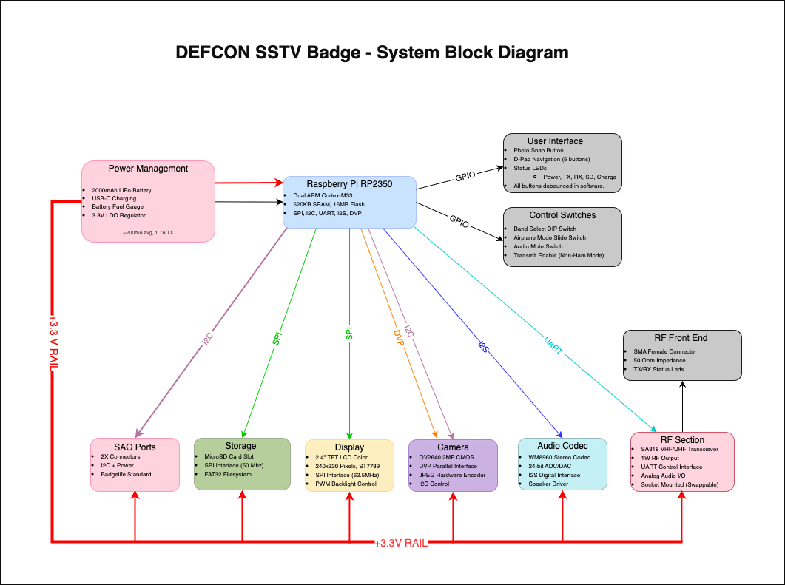

# Documentation

This directory contains technical documentation for the DEFCON SSTV Badge project.

## System Overview

The DEFCON SSTV Badge combines amateur radio, digital imaging, and embedded systems into a wearable electronic badge for the badgelife community. The system uses a dual-core RP2350B microcontroller with SA818 radio transceiver to capture, encode, transmit, and receive SSTV (Slow Scan Television) images.

## Documentation Files

### Hardware Design

**[electrical-design.md](electrical-design.md)**
Complete electrical design with circuit schematics, component specifications, GPIO assignments, and pin connections for all subsystems.

**[bom.md](bom.md)**
Bill of materials with part numbers, quantities, cost estimates, and sourcing recommendations.

**[project-status.md](project-status.md)**
Design and implementation status tracker for all subsystems.

### Software Architecture

**[firmware-architecture.md](firmware-architecture.md)**
Dual-core firmware design, real-time constraints, SSTV signal processing, and embedded C API design.

### Engineer's Notebook

**[engineers-notebook/](engineers-notebook/)**
Design decisions, trade-off analyses, and educational background material. These documents explain *why* the design is what it is.

## Technical Specifications

| Parameter | Specification |
|-----------|---------------|
| **Microcontroller** | Raspberry Pi RP2350B (Dual ARM Cortex-M33, QFN-80) |
| **Radio** | SA818 VHF/UHF transceiver, 1W output (on carrier board) |
| **Camera** | OV2640 2MP, parallel DVP interface |
| **Display** | 2.4" ILI9341 TFT LCD, 320x240 pixels |
| **Audio** | PCM5102A DAC (TX) + RP2350 ADC (RX) |
| **Storage** | MicroSD card (user supplied) |
| **Power** | 2000mAh LiPo, USB-C charging, TPS63001 buck-boost |
| **Battery Life** | 8-10 hours typical use |
| **Dimensions** | ~120mm x 95mm TV-shaped PCB + 50mm rabbit ear antennas |
| **Interfaces** | SMA antenna (on carrier), 2x SAO expansion ports |

## Signal Flow

### Transmit Mode
Photo capture → Image processing → Callsign overlay → SSTV encoding → PCM5102A DAC → SA818 radio → Antenna

### Receive Mode
Antenna → SA818 radio → RP2350 ADC → SSTV decoding → Image reconstruction → Display → SD card storage

### User Interface
D-pad controls → RP2350 Core 0 → Menu navigation → Display updates → Status feedback

---

*This documentation is continuously updated as the project evolves. Check the git history for the latest changes and improvements.*
